# Pantry

Plan the week's meals, scale recipes to the people who are eating, keep track
of what is in the house, and walk into the shop with a list that is already
sorted by shelf. Everything lives in plain Markdown notes in your vault:
recipes, products, shops, weekly plans and shopping lists. No accounts, no
servers, no network requests.

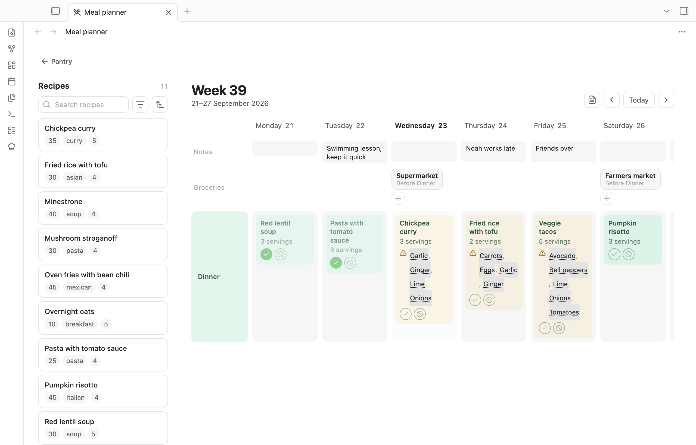

## What it does

**Plan the week.** Drag recipes onto the days. Tick who is eating, and Pantry
works out the servings: a child can count as half an adult portion, guests
count as a full one. A note per day holds what the calendar says, and grocery
stops mark when a shop's goods arrive.

**Cook from the note.** Cook mode shows the ingredients scaled to tonight's
servings, step by step, with checkboxes and timers. Each cooking session is a
note, so it survives a restart and syncs to the phone.

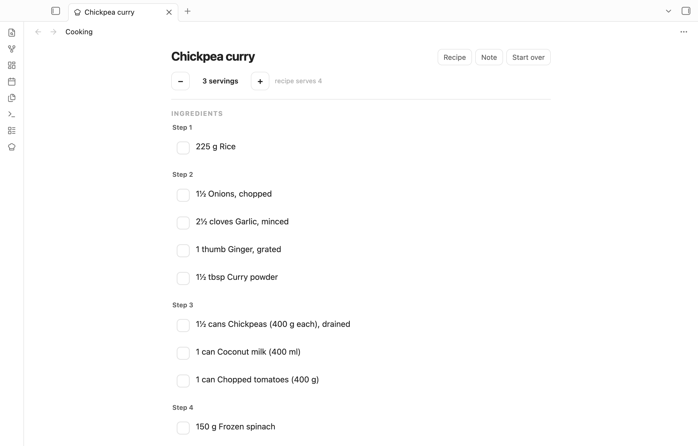

**Shop per trip.** A shopping list is one trip to one or more shops. Pick the
day and the meals it covers, check what is in the house, then shop. The list is
sorted in the order you walk through the shop.

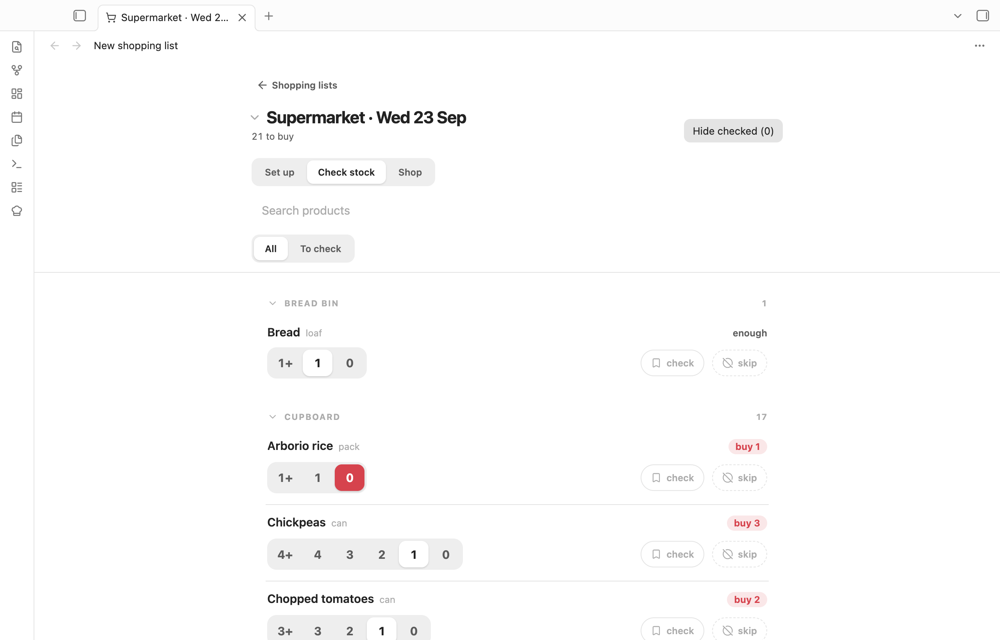

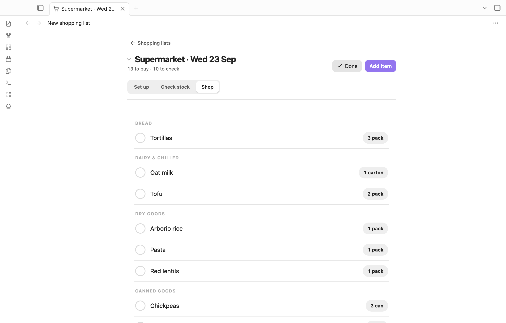

**Know what is in the house.** Each product is a note: how it is bought, where
it lives, how many to keep in stock. Counting is a tap. Tick a meal as eaten
and the stock goes down by what the recipe used.

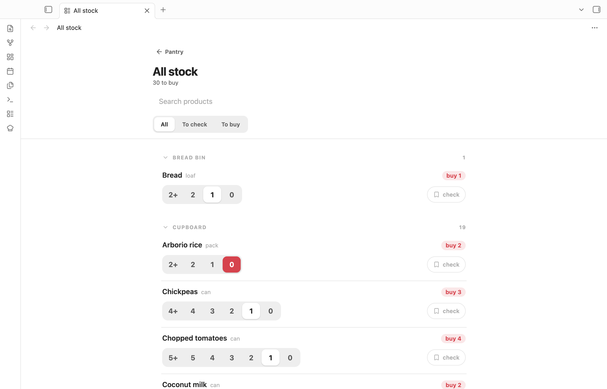

**Keep recipes and products in step.** The cleanup screen shows every recipe
line that does not yet point at a product and helps you fix it in one place.

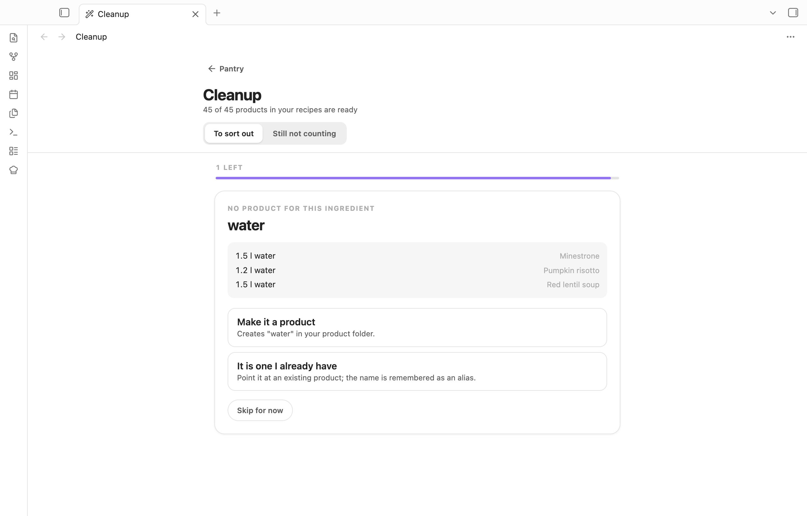

**Works on the phone.** Every screen fits a narrow window, so the list you
made on the desktop is the one you tick off in the shop.

<p>
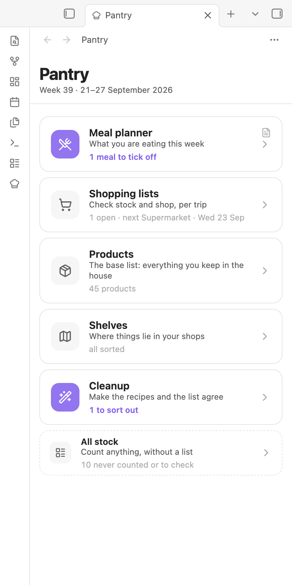
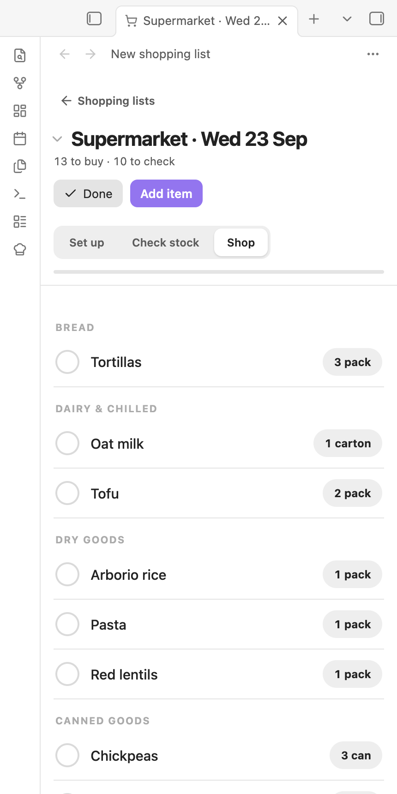
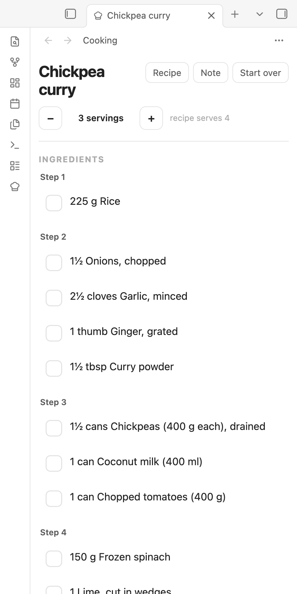
</p>

## Your notes stay yours

Pantry reads and writes ordinary Markdown. Nothing is stored anywhere else,
and you can edit every note by hand.

- **Recipes** are notes in a folder you choose. Ingredients are a bulleted
  list under an `## Ingredients` heading; a `[[wikilink]]` in a line points it
  at a product. A `servings` field in the frontmatter says how many the recipe
  is written for. Any other frontmatter field can be shown on the recipe card
  and used as a filter.

  ```markdown
  ---
  servings: 4
  time: 35
  type: [curry]
  ---

  # Chickpea curry

  ## Ingredients

  - 2 cans [[Chickpeas]] (400 g each), drained
  - 1 can [[Coconut milk]] (400 ml)
  - 2 [[Onions]], chopped
  - 300 g [[Rice]]

  ## Method

  1. ...
  ```

- **Products** are notes too, one per thing you keep in the house. The
  frontmatter says how it is bought and where it lives; the body is yours.

  ```yaml
  minimum: 2        # keep at least this many
  unit: can
  size: 400 g
  shop: Supermarket
  storage: Cupboard
  shelf: Canned goods
  count: 1
  counted: 2026-09-21
  ```

  Something you never run out of and never measure, such as salt, gets
  `amount: any` instead of a size.

- **Shops** are notes with `pantry: shop` and a list of shelves in the order
  you walk past them.

- **Weekly plans** are one note per week. The plan is a `meal-plan` code block
  in the note, and the block renders as the planner itself, so the note and
  the planner tab are the same thing.

  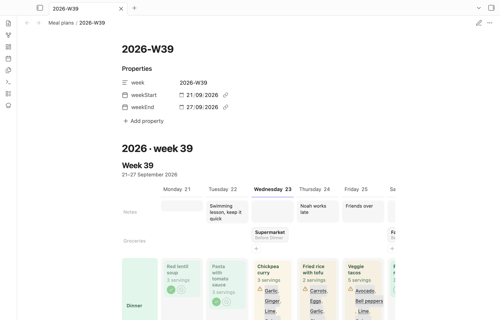

- **Shopping lists** are one note per trip in `Pantry/Shopping/`. The choices
  go in the frontmatter; the body is the checklist, kept in step with the
  product notes. Tick a box in the note and the product counts as full again.

Every note Pantry writes carries a `format` number. A device running an older
build reads newer notes but never overwrites them, so two devices on
different versions cannot lose each other's work.

## Getting started

1. Install the plugin and enable it.
2. Click the chef's hat in the ribbon, or run **Pantry: Open home**. The setup
   walks you through the recipe folder, the meals you plan (dinner only, or
   breakfast, lunch and dinner), and who eats along.
3. Put recipes in the recipe folder. Link ingredients to products with
   `[[wikilinks]]`, or run **Create products from recipes** to make a product
   note for every linked ingredient at once.
4. Open the meal planner and drag a recipe onto a day.

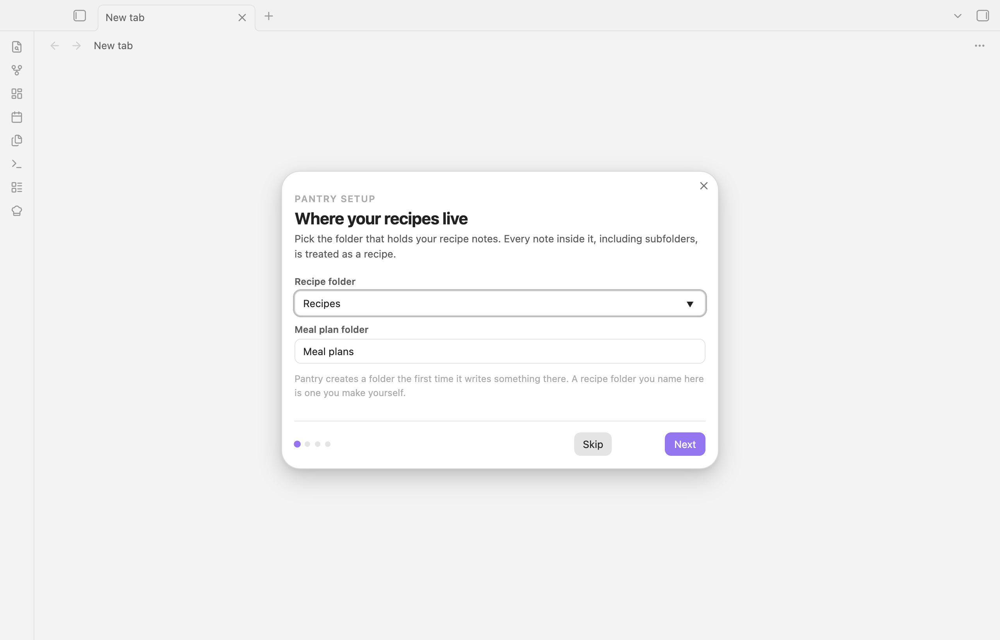

## Commands

| Command | What it does |
| --- | --- |
| Open home | The overview with the week and every other screen |
| Open meal planner | This week's plan |
| Open shopping lists | Every open list |
| New shopping list | Start a trip |
| Open all stock | Count anything, without a list |
| Open products | The base list of what you keep in the house |
| Open shop shelves | Sort products onto shelves, per shop |
| Open cleanup | Recipe lines that do not yet point at a product |
| New product | Add a product |
| Create products from recipes | A product note for every linked ingredient that has none |
| Cook this recipe | Cook mode for the open recipe note |
| Continue this cooking session | Pick up an open session note |
| Run setup | The first-run walkthrough, again |

## Settings

Folders for recipes, plans, products, shops, shopping lists and cooking
sessions; the day the week starts; how many days ahead a shopping list looks;
the meals you plan; the household and each person's portion factor; which
recipe fields to show on the cards; and how long finished cooking sessions and
shopping lists are kept.

## Development

```bash
npm install
npm run dev            # watch build
npm run build          # tests, type check, minified main.js
npm run lint
node scripts/screenshots.mjs   # README screenshots from the demo vault (macOS)
```

The `demo/` folder holds a small sample vault: a household of four, eleven
recipes, the products they use, two shops and a planned week. The screenshot
script copies it into a throwaway vault and drives Obsidian to take the
pictures, so no real vault is ever photographed.

## License

MIT
